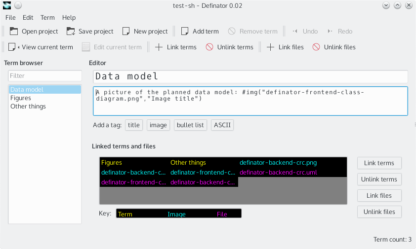

# Definator

## What Definator is

Definator is a program to write up terms, cross reference them and write
up structured descriptions for them. It can also link files to terms. It is
supposed to be useful for example in a lecture or other vice to gather
concepts and form a picture of the area by mapping relations of concepts and 
to attach related data to them.

## How to use it

A help project comes with the application, which can be opened from "Help -->
Open help..." -menu.

## Current release

In current release ([download](https://dl.dropboxusercontent.com/u/15617513/definator-releases/definator-v0.02.zip))
(git tag v0.02) the application is functional, but very little tested. Probably 
there are bugs and also there are ideas not yet implemented.

## Screen shots

Here is one shot of view mode:

and another one from edit mode:

.

## Operation systems and dependencies

Definator is developed on Linux and thus works best in it. It runs on windows
based on a short test and it should also run in a Mac.

On the development machine Definator uses PyQt 5.3.2, Qt 5.3.2 and Python 3.4.1.
It would be nice to hear how it runs in other environments. PyQt5 and Qt5 bundle can be downloaded  from here: [Download PyQt5](http://www.riverbankcomputing.co.uk/software/pyqt/download5 "PyQt 5 binarieds"), which should be fairly easy to
install. On windows python 3 needs to be also installed, before it can run the
application.

The application can be run by starting definator.py located at the root of the project.

## Mailing list

A mailing list will be set up for informing about developments.

## Licensing

**Definator** is licensed **[GPLv3](http://www.gnu.org/licenses/gpl-3.0.txt)**, which is in line with the [Qt 5](http://qt-project.org/doc/qt-5/licensing.html) and [PyQt 5](http://www.riverbankcomputing.co.uk/software/pyqt/license) licensing options.

## Context

The application is developed as a part of
[graphical UI programming course TIEA212](http://appro.mit.jyu.fi/gko/) (2014)
at the University of Jyväskylä. It is also developed to scratch an itch to have
this kind of a tool at hand, to learn python, to learn qt and for fun.

Author Niko Humalamäki (nikohuma at gmail.com).
